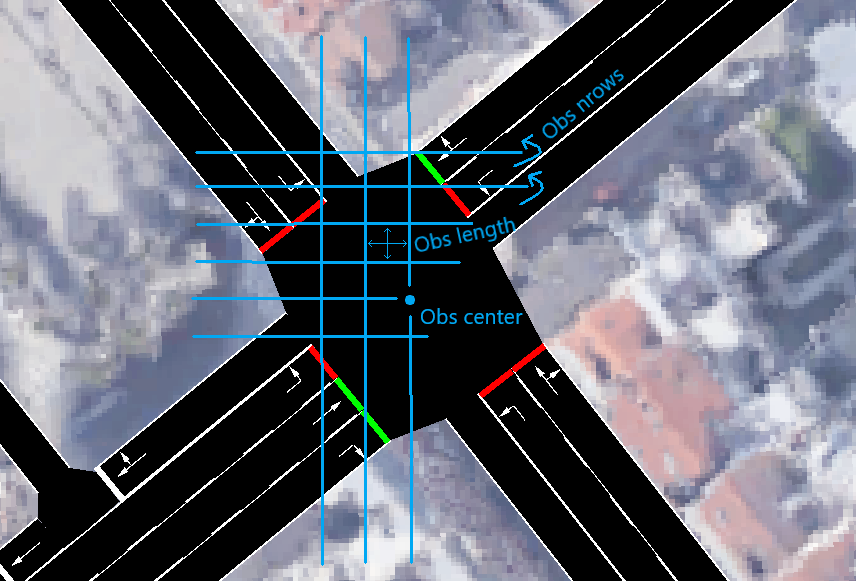

<!--  -->

This repository implements the use of reinforcement learning for controlling traffic light systems.
While the code is abstracted in order to be applied on different scenarios, a real-life implementation is provided for illustration purposes too.
 Toolkit-wise, <code>stable-baselines3</code> is used in conjunction with the **Simulation of Urban MObility** (SUMO) software for learning on multiple traffic simulations in parallel.
Some highlights of this implementation:
* Pytorch as backend.
* Vectorized environments.
* Playable set-up to get human baselines.
* Designed for reproducibility to other sumo networks.

 (A legacy <code>keras</code> + <code>tensorflow</code> implementation is still available in the aptly named branch.)

 

Installation
============

1. Install **sumo** software from https://eclipse.dev/sumo/
2. Run <code>conda install -f environments/environment.dev.yml</code>

 

Quickstart for testing the provided use-case
============================================

The traffic lights at a 4-way traffic intersection is controlled by a PPO model.
The cars' destinations and origins, defining the general simulation, are randomized every episode (though we fixed it for the final eval env runs).

The following snapshots illustrate the parameters pertaining to the road network.

 
For testing the model simply run <code>python -m scripts.rl.test</code>. You can also try your best to beat it running <code>python -m scripts.baseline.human</code>.

The final model acting on the simulation:

 
The results from the different policies below:

If you'd wish to retrain or investigate how the training was done, check out <code>scripts/rl/train.py</code>.

 

A note on the agent design
==========================
In terms of general model improvement decisions, these were the most prominent:
* Baseline mlp with multi-input <code>spaces.Dict</code> observations:
    * <code>(1, n_actions)</code> for the <code>shape</code> observation vs.
    * <code>(1, n_obs, n_obs)</code> for the <code>speed</code>, <code>position</code> and <code>wait</code> matrices.
* Dropping the <code>position</code> matrix in favor of vehicle absence encoding in the </code> <code>speed</code> and <code>wait</code> matrices (with vehicle absence as -1, and normal values ranging [0, 1]).
* Inclusion of the <code>accel</code> matrix.
* Changing <code>phase</code> encoding to <code>(1, n_obs, n_obs)</code> instead of <code>(1, n_actions)</code>.
* Introduction of weighted (<code>w2</code>) unshaped long-term reward, balanced against the weighted (<code>w1</code>) shaped myopic reward.
* Moving from the above fixed <code>w1</code>/<code>w2</code> balance, to a curriculum approach for faster convergence.
* Multi-input cnn treating each matrix seperately (though with the same conv block).
* Single-input cnn with observation types as channels.
* Framestacking and Conv3D introduction for temporal encoding.
* Self-attention mechanism on depth and channels.

 

Designs not witheld (yet):
* Residual blocks
* (Cross)-attention mechanisms (as we've moved away from the multi-input design)

How to apply to a new use-case:
===============================

* Create a new network and replace the <code>intersection.net.xml</code> file in the /sumo/*/ folders
* Change the <code>sumo-env.cfg</code> values accordingly (see also the [Quickstart](#quickstart-for-testing-the-provided-use-case) above for some more details), specifically:
    * Find the x- and y-coordinates of your observation window's center (<code>obs_center</code>)
    * Denote your observation window's precision (<code>obs_length</code>) and size (<code>obs_nrows</code>)
    * Identify the traffic light id to be controlled (<code>tls_id</code>)
    * List the traffic light's incoming lanes (<code>tls_lanes</code>) and non-yellow phases (<code>tls_phases</code>)
    * List the network's sources (<code>rnd_src</code>) and destinations (<code>rnd_dst</code>)
* Potentially rename the <code>network</code> and <code>config</code> arguments in the <code>SumoEnv</code> or <code>SumoEnvFactory</code> initialization

 

Future developments
===================
<input type="checkbox">General clean-up</input>

<input type="checkbox">Get better results</input>

<input type="checkbox">Increase the traffic scenario variability</input>

<input type="checkbox">Generalize to multiple traffic lights</input>

<input type="checkbox">Add multi-(hierarchical)-agent support</input>
